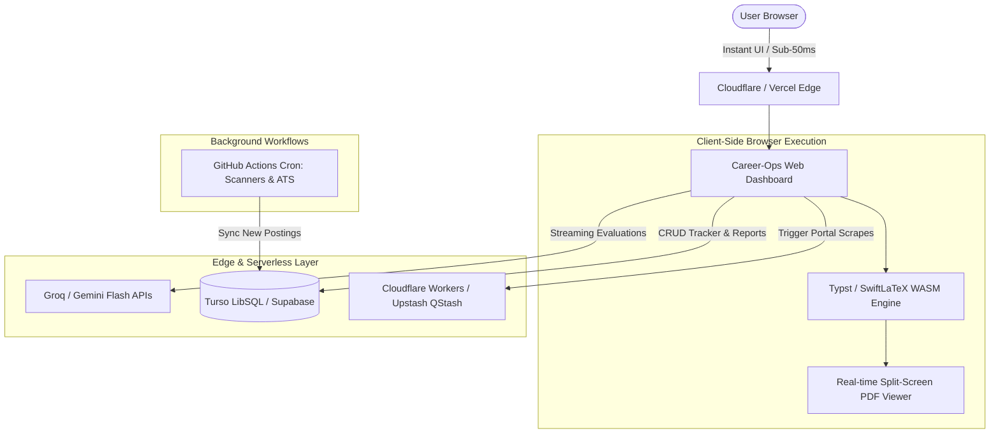

# Product Requirements Document (PRD)
## Career-Ops Cloud & Web Architecture ("Zero-Cost, Minimal Latency")

---

### Executive Summary & Objective
Convert the current CLI/local markdown-based **Career-Ops** pipeline into an ultra-fast, modern, reactive full-stack web application hosted completely on **100% Free-Tier Cloud Infrastructure** with **sub-second UI latency** and instantaneous AI stream responses.

---

### 1. System Philosophy & Architecture Principles
1. **$0.00 / Month Forever**: Leverage generous free-tier offerings without accidental paywalls.
2. **Zero-Cold-Start / Minimal Latency**: Pure edge static frontend + serverless edge handlers + local/in-browser WASM compilers + sub-200ms LLM streaming.
3. **Vibe Coding Guardrails**: Strict modular contract boundaries so AI code generators cannot break resume formatting, parsing logic, or pipeline state.
4. **Data Privacy & Portability**: Git/Markdown or SQLite dual-sync so the local workflow remains fully compatible.

---

### 2. Recommended Tech Stack

| Layer | Recommended Technology | Free Tier Budget & Limits | Latency Advantage |
| :--- | :--- | :--- | :--- |
| **Frontend UI** | **Next.js 15 (App Router)** or **Vite + React / TanStack Router** | Vercel / Cloudflare Pages (Unlimited static / 100k edge req/day) | Sub-50ms TTFB via global edge CDN |
| **Styling & Components** | **Tailwind CSS + Shadcn UI + Lucide Icons** | N/A (Client-side bundle) | Instant layout rendering, zero runtime CSS overhead |
| **Database & State** | **Turso (LibSQL / Edge SQLite)** or **Supabase (PostgreSQL)** | Turso: 9GB storage, 1B read rows/mo Supabase: 500MB DB, 50k monthly active users | Sub-10ms query times at Edge replicas |
| **Auth & Sessions** | **Clerk** or **Supabase Auth** / **Lucia (Self-hosted SQLite session)** | Clerk: 10,000 MAUs free Supabase: 50k MAUs free | Client-side cached JWTs; zero backend roundtrip on navigation |
| **Fast LLM Engine** | **Groq API** (`llama-3.3-70b-versatile` / `deepseek-r1-distill-llama-70b`) & **Google Gemini 2.5 Flash** | Groq: Free tier (~30 RPM, 14.4k RPD) Gemini: 15 RPM / 1M TPM free | **500-800 tokens/sec** output latency (sub-200ms time to first token) |
| **PDF & LaTeX Engine** | **Client-side WASM (SwiftLaTeX / Typst WASM)** or **Cloudflare Worker + typst-ts** | Free on client browser CPU (Zero server cost) | Instant browser PDF rendering without spinning up Node Playwright/Docker |
| **Background Automation & Scanners** | **GitHub Actions** (Cron schedule) + **Cloudflare Cron Triggers** | GitHub Actions: 2,000 free runner mins/mo Cloudflare Workers: 100k requests/day | Zero server instances running 24/7 |

---

### 3. Core Features & Capabilities

#### Feature 1: Interactive Live-Pipeline & Tracker (Kanban / Table)
- **Fast Views**: Instant transition between Spreadsheet/Table view and Kanban Board (`Evaluated` -> `Applied` -> `Interview` -> `Offer` -> `Hired`).
- **Optimistic UI Updates**: State changes reflect instantly with TanStack Query and sync asynchronously to Turso/Supabase.

#### Feature 2: 1-Click Offer Evaluator & Triage (Zero-Latency Stream)
- Input: URL or pasted raw Job Description.
- Engine uses **Groq Llama-3.3-70b** or **Gemini 2.5 Flash** via Server-Sent Events (SSE).
- Output: A-F Multi-dimensional Fit Scorecard, Salary Gap Radar, Red Flag Detection, and Actionable Recommendation rendered in markdown under 2 seconds.

#### Feature 3: Split-Screen Live CV Tailor & Instant PDF Generator
- Left pane: ATS-optimized Markdown / LaTeX / Typst editor with targeted bullet point suggestions.
- Right pane: In-browser WASM-rendered PDF viewer updating in real-time as you tweak metrics or keywords.
- Single-page compliance validator embedded in the DOM.

#### Feature 4: Portal Scanner & ATS Ingestion Engine
- Scheduled ATS scanners (Greenhouse, Lever, Ashby, Workday) execute via lightweight GitHub Action Crons or Cloudflare Workers without incurring API cost.
- Matches new postings against user profile & archetypes and feeds them into the Pipeline Inbox with liveness verification.

---

### 4. "Vibe-Coding" Without Breaking Anything (Step-by-Step Blueprint)

When coding via AI agents (Vibe-Coding), software degrades when state, types, and logic are coupled together in large monoliths. To build the entire web app flawlessly with AI:

#### Step 1: Immutable Schema & Type Contracts First (Day 1)
- Write strict TypeScript Zod schemas for every entity: `JobPosting`, `EvaluationReport`, `ApplicationEntry`, `ProfileConfig`, `StoryBank`.
- Any AI generation must pass `zod.parse()` validation.

#### Step 2: Database & Data Access Layer Mocking (Day 2)
- Build repository functions (`getApplications()`, `saveReport()`, `updateStatus()`) backed by Turso/LibSQL or local IndexedDB/LocalStorage for local-first testing.

#### Step 3: Pure Component UI Scaffolding (Day 3)
- Build individual UI molecules using Shadcn UI without business logic:
  - `<EvaluationScorecard />`
  - `<ApplicationsTable />`
  - `<PdfPreviewPane />`
  - `<TriageDrawer />`

#### Step 4: Streaming LLM API Routes (Day 4)
- Wire the Groq / Gemini Flash streaming route handlers.
- Use standard AI SDK (`@ai-sdk/react` or `useCompletion`) to handle token streaming into markdown UI smoothly.

#### Step 5: WASM PDF Compiler Integration (Day 5)
- Integrate `@myriaddreamin/typst.ts` or `swiftlatex` for instant client-side PDF generation.

---

### 5. Zero-Cost Free Tier Verification

| Service | Free Tier Limit | Career-Ops Usage (Estimated) | Cost |
| :--- | :--- | :--- | :--- |
| **Vercel / Cloudflare Pages** | 100 GB bandwidth, unlimited deployments | < 2 GB bandwidth / mo | **$0.00** |
| **Turso LibSQL** | 9 GB storage, 1 Billion row reads | ~10 MB storage, ~50,000 reads | **$0.00** |
| **Groq Cloud API** | 14,400 requests / day (Llama 3.3 70B) | ~50-200 evaluations / day | **$0.00** |
| **Google Gemini API** | 1,500 requests / day (Gemini 2.5 Flash) | Secondary backup / Deep research | **$0.00** |
| **GitHub Actions** | 2,000 runner minutes / month | ~120 minutes / mo for cron scanner | **$0.00** |
| **Total Monthly Cost** | — | — | **$0.00** |

---

### 6. Summary & Next Steps

This blueprint gives you a **complete, high-performance, $0/month modern web application** replicating and expanding all local CLI capabilities with zero latency and high visual fidelity.
